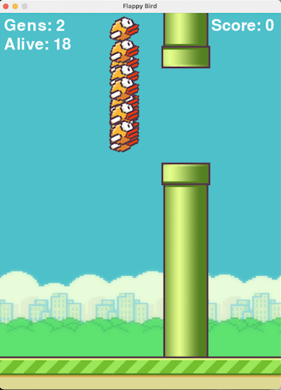
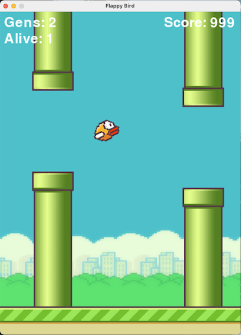
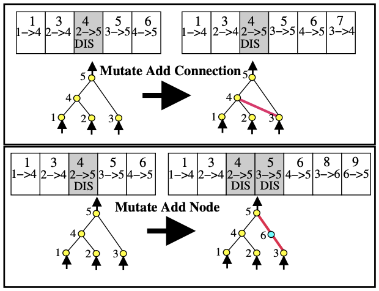

# NeatFlappyBird
A flappy bird replica game where AI agents try to go full Buzz Lightyear (to infinity and beyond!).

                    

Checkout the gameplay video below!

## NEAT - Neuroevolution of Augmenting Topologies
Neuroevolution, the artificial evolution of neural networks using genetic algorithms, can mutate (change) both connection weights and network structures. Connection weights mutate as in any NE system, with each connection either perturbed or not. Structural mutations, which expand the genome, occur in two ways. In the add connection mutation, a single new connection gene is added connecting two previously unconnected nodes. In the add node mutation an existing connection is split and the new node placed where the old connection used to be. The old connection is disabled and two new connections are added to the genome. This method of adding nodes  integrates new nodes immediately into the network.

## Running the Code
Simply open neat_flappy_birds.py and click 'run'. The game should start and the AI agents should begin to play the game. 
You can turn off the red lines in the code by switching 'DRAW_LINES' to False.

## Resources
I highly recommend reading Kenneth O. Stanley's and Risto Miikkulainen's paper, [Efficient Evolution of Neural Network Topologies](http://nn.cs.utexas.edu/downloads/papers/stanley.cec02.pdf) which is the grandfather of Neat algorithms. 

Also check out Ken's webpage here - http://www.cs.ucf.edu/~kstanley/#publications

## Gameplay
Check out a video of the gameplay below. The AI agent usually can beat the game in only a few generations, but occasionally it can never beat it! It all depends on how the network mutates.. You never know percisely what the RL algorithm will do, which is what makes this so much fun (and possibly frustrating!).

